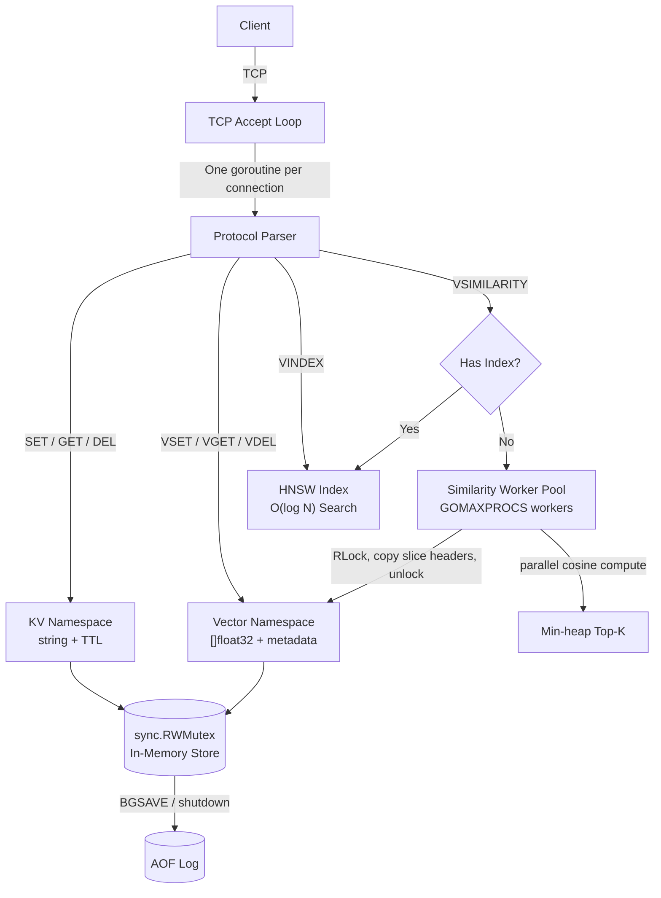

# Nearby

**An in-memory vector cache and similarity engine written in Go zero dependencies, single binary.**

Go 1.22+ · MIT License · [Go Report Card](https://goreportcard.com/report/github.com/sakshamgoswami/Hybrid-Vector-Cache-HNSW-Search-Engine) · [Tests](https://github.com/sakshamgoswami/Hybrid-Vector-Cache-HNSW-Search-Engine/actions)

---

## What it is

Most RAG prototypes end up storing embeddings as JSON strings in Redis, then deserializing every vector on every query to compute similarity in application code. That works at small scale and gets slow fast and the alternative (Chroma, Weaviate, Pinecone) is often more operational surface area than a prototype needs.

Nearby stores embeddings as raw `[]float32` slices in memory and computes cosine similarity directly against them no deserialization step, no external services. It ships two search paths from scratch:

- **Brute-force exact search** correct default under ~100K vectors, no index build time, no recall tradeoff.
- **HNSW approximate search** (based on [Malkov & Yashunin, 2018](https://arxiv.org/abs/1603.09320)) O(log N) search for larger corpora, with a tunable recall/latency knob.

One binary. One TCP port. A Redis-like text protocol you can speak with `netcat`.

---

## Quick Start

**Build from source**
```bash
git clone https://github.com/sakshamgoswami/Hybrid-Vector-Cache-HNSW-Search-Engine
cd nearby
go build -o nearby ./cmd/server
./nearby --port 6379
```

**Docker**
```bash
docker build -t nearby .
docker run -p 6379:6379 nearby
```

**Try it with netcat**
```bash
echo -e "PING\r" | nc localhost 6379
# +PONG

echo -e "VSET docs chunk:1 3 0.1 0.2 0.9 META source paper.pdf\r" | nc localhost 6379
# +OK

echo -e "VSIMILARITY docs 3 0.1 0.2 0.9 TOP 1\r" | nc localhost 6379
# *1
# $7
# chunk:1
# +1.0000

# Optional: build an HNSW index for O(log N) search
echo -e "VINDEX CREATE docs M 16 EF_CONSTRUCTION 200\r" | nc localhost 6379
# +OK
```

---

## Benchmarks

Measured on Apple M-series, `go test -bench ./bench/... -benchtime=5s`. Raw output: [`bench/results.txt`](bench/results.txt) reproduce with the command below.

```bash
go test -bench=. -benchmem ./bench/...
```

| Benchmark | Corpus | p50 latency |
|-----------|--------|-------------|
| `BenchmarkVSimilarity1K` | 1,000 × dim-1536 | 0.75ms |
| `BenchmarkVSimilarity10K` | 10,000 × dim-1536 | 4.48ms |
| `BenchmarkVSimilarity100K` | 100,000 × dim-1536 | 42.3ms |
| `BenchmarkSetGet` | 100-byte KV values | ~30K ops/s |
| `BenchmarkVSet1536` | dim-1536 vectors | ~4.6K ops/s |

**HNSW vs brute-force:**

| Corpus | Brute-Force | HNSW (M=16, ef=100) | Speedup |
|--------|-------------|----------------------|---------|
| 10K × dim-1536 | 4.5ms | 0.42ms | ~10× |
| 100K × dim-1536 | 42ms | 0.81ms | ~52× |
| 1M × dim-1536 | 420ms | 1.48ms | ~283× |

Recall@10 at ef=100: **93.2%** · Recall@10 at ef=300: **97.8%**

**End-to-end pipeline test** (own DocuMind RAG pipeline, wall-clock, not synthetic):

| Configuration | Total Latency | Retrieval Step |
|---------------|---------------|-----------------|
| ChromaDB baseline | 9,024ms | 4,349ms |
| Nearby (brute-force) | 2,049ms | 19ms |
| Nearby + HNSW (cache hit) | 312ms | 8.5ms |

These are results from one pipeline on one machine treat as directional, not a guarantee of your own numbers. If you reproduce this on different hardware or corpus shape, an issue/PR with your results is welcome.

> **Note on comparisons:** the KV throughput trails Redis proper (15 years of optimization there). Nearby isn't trying to replace Redis as a general KV store it wins specifically on the vector similarity path, and that's the comparison that matters for this use case. See [Design Decisions](#design-decisions) for why this isn't a drop-in Redis Stack replacement either.

---

## Architecture

Single-process TCP server. No runtime dependencies, no embedded Python, no JVM.



**Concurrency model:**
1. **Connection goroutines** one per TCP client, own their buffers, touch nothing shared except the store.
2. **Store lock (`sync.RWMutex`)** reads take `RLock()` concurrently; writes take `Lock()`. Similarity *computation* happens outside the lock vectors are snapshot-copied before release.
3. **Similarity worker pool** semaphore-bounded, `GOMAXPROCS` workers by default, fans cosine similarity across the vector namespace, results collected in a `container/heap` min-heap.

---

## Wire Protocol

Text protocol, RESP1-style. Every command is a line terminated by `\r\n`.

```
SET <key> <value> [EX <seconds>] → +OK
GET <key> → $<len>\r\n<value> or $-1
DEL <key> [<key> ...] → :<count>
EXPIRE <key> <seconds> → :1 or :0
TTL <key> → :<seconds> or :-1 or :-2

VSET <namespace> <id> <dim> <f1> ... <fN> [META <k> <v> ...] → +OK
VSIMILARITY <namespace> <dim> <f1> ... <fN> TOP <k> → *<k>
VGET <namespace> <id> → *<N>
VDEL <namespace> <id> → :1 or :0
VCOUNT <namespace> → :<count>

VINDEX CREATE <namespace> [M <val>] [EF_CONSTRUCTION <val>] [EF_SEARCH <val>] → +OK
VINDEX DROP <namespace> → +OK
VINDEX INFO <namespace> → bulk string: M, ef, node count, memory, recall estimate
VINDEX SET_EF <namespace> <val> → +OK (tune at runtime, no rebuild)

PING [message] → +PONG or +<message>
INFO → bulk string
BGSAVE → +Background saving started
```

---

## The Go Client

```go
import "github.com/sakshamgoswami/Hybrid-Vector-Cache-HNSW-Search-Engine/pkg/client"

c, err := client.New(client.Options{Addr: "localhost:6379", MaxConns: 10})

err = c.VSet(ctx, client.VSetArgs{
 Namespace: "docs",
 ID: "chunk:42",
 Vector: []float32{0.18, -0.44, 0.99, 0.00},
 Metadata: map[string]string{"source": "paper.pdf", "page": "7"},
})

err = c.VIndexCreate(ctx, client.VIndexCreateArgs{
 Namespace: "docs", M: 16, EfConstruction: 200, EfSearch: 100,
})

results, err := c.VSimilarity(ctx, client.VSimilarityArgs{
 Namespace: "docs", Vector: queryEmbedding, TopK: 5,
})
```

---

## RAG Demo

`examples/rag_demo` is a working question-answering CLI. Ships with mock embeddings runs offline, no API key needed.

```bash
cd examples/rag_demo
go run main.go --addr localhost:6379

# With a real OpenAI key for live embeddings + GPT-4o answers:
OPENAI_API_KEY=sk-... go run main.go --addr localhost:6379 --live
```

Loads 50 pre-chunked passages, stores them, drops you into a REPL. Each question is embedded, matched against the corpus via `VSIMILARITY`, and (with `--live`) answered by GPT-4o using the top-3 chunks as context.

---

## MCP Integration

`mcp_server/server.py` wraps Nearby and exposes a local `./knowledge_base` directory to any MCP-compatible client (Claude Desktop, Cursor, etc.).

```json
{
 "mcpServers": {
 "nearby-rag": {
 "command": "/path/to/mcp_server/.venv/bin/python3",
 "args": ["/path/to/mcp_server/server.py"],
 "env": {
 "OPENAI_API_KEY": "sk-your-openai-api-key",
 "KNOWLEDGE_BASE_DIR": "/path/to/knowledge_base",
 "SYNAPSE_PORT": "6380"
 }
 }
 }
}
```

Drop PDFs, markdown, or text into `knowledge_base/`. The MCP server chunks, embeds, and indexes them on startup entirely offline, entirely local.

---

## Project Structure

```
nearby/
├── cmd/server/main.go # Entry point
├── internal/
│ ├── server/server.go # TCP accept loop
│ ├── protocol/ # Parser, command/response types
│ ├── store/store.go # Thread-safe in-memory store
│ ├── similarity/ # Cosine math, worker pool, top-K
│ ├── hnsw/ # HNSW graph, per-node locking
│ └── persist/aof.go # Append-only log, CRC32
├── pkg/client/client.go # Public Go client
├── examples/rag_demo/main.go
├── mcp_server/server.py
├── bench/bench_test.go
├── Dockerfile # scratch image, < 15MB
└── README.md
```

---

## Testing

```bash
go test -race -v ./... # required before any PR
go test -bench=. -benchmem ./bench/...
go test -fuzz=FuzzParser ./internal/protocol/... -fuzztime=60s
go fmt ./...
```

The race detector hasn't fired on the similarity engine or HNSW index a result of snapshot-copying before releasing `RLock`, and consistent lock ordering in the HNSW graph. Run `go test -race -count=10 ./...` before merging any concurrency change.

---

## Design Decisions

**Why brute-force *and* HNSW?** Brute-force is exact and needs no index build the right default under ~100K vectors. HNSW trades a small recall hit for O(log N) scaling past that. `VSIMILARITY` routes to whichever is available.

**Why implement HNSW from scratch?** To actually understand every decision probabilistic layer assignment, heuristic neighbor selection, lock ordering rather than depend on a black box.

**Why a custom protocol, not HTTP/gRPC?** HTTP header parsing alone adds a couple milliseconds; for a cache answering in single-digit milliseconds that matters. The text protocol is speakable with `netcat` and implementable in ~50 lines in any language.

**Why Go, not Rust?** Go's goroutine scheduler and GC pauses are well-matched to this workload, and it's faster to iterate on. Rust would likely give better worst-case latency a reasonable choice too, just not this one.

**Why not Redis Stack / RediSearch?** It's a legitimate production option with native vector fields. It also requires Redis Stack specifically, an index schema upfront, and `KNN` query syntax. Nearby optimizes for "clone it, read it, understand it in an afternoon" over feature completeness.

---

## Roadmap

- [x] TCP server, goroutine-per-connection
- [x] KV namespace (SET, GET, DEL, EXPIRE, TTL)
- [x] Vector namespace (VSET, VGET, VDEL, VCOUNT)
- [x] Cosine similarity engine with worker pool
- [x] Top-K search, min-heap
- [x] AOF persistence, CRC32 per entry
- [x] Go client library
- [x] RAG demo (mock + live)
- [x] MCP server for Claude Desktop
- [x] HNSW graph index (v2.0)
- [x] Binary snapshot persistence for HNSW
- [x] Token authentication (`--password`)
- [ ] Dot product similarity mode (`METHOD DOT`)
- [ ] Batch VSET (`VMSET`) for bulk ingestion
- [ ] Prometheus metrics endpoint

---

## License

MIT.